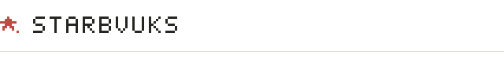

<picture>
  <source media="(prefers-color-scheme: dark)" srcset="assets/header-dark.svg">
  <source media="(prefers-color-scheme: light)" srcset="assets/header-light.svg">
  
</picture>

busy building cool shit.

### selected work

- [fitbook](https://github.com/starbvuks/selected-work/tree/main/fitbook) — desktop fashion discovery. local data, a wardrobe, a sense of taste.
- [the sandwich manifesto](https://github.com/starbvuks/selected-work/tree/main/sandwich-manifesto) — one sandwich recipe, given a whole interface.

### early work

- [colour kit](https://github.com/starbvuks/themes-colorkit) — playing with themes. `2021`
- [pomodoro](https://github.com/starbvuks/pomodoro-demo) — a browser timer with somewhere to put your tasks. `2021`

Selected work links to public project notes. Those projects' source stays private.
